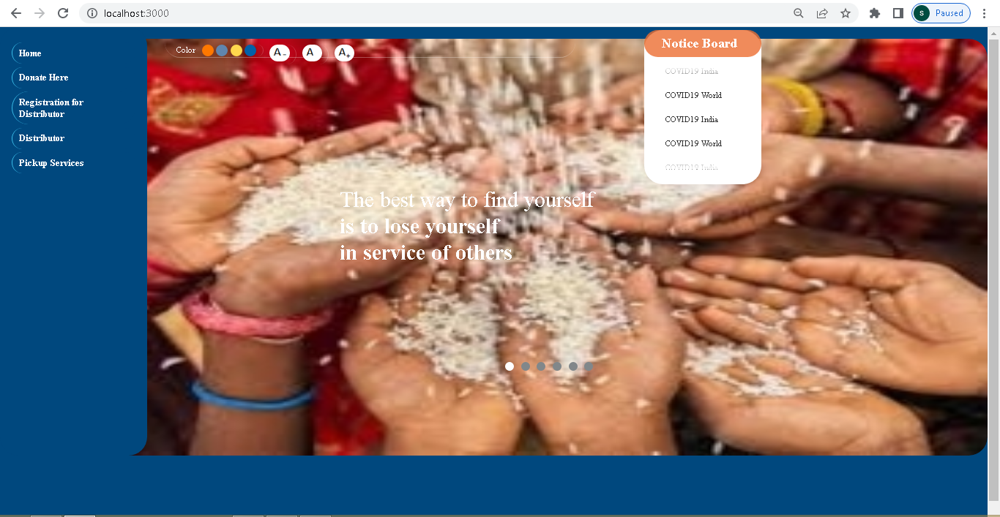
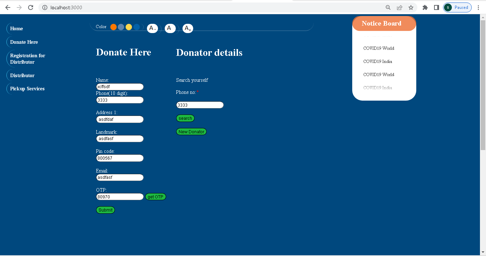
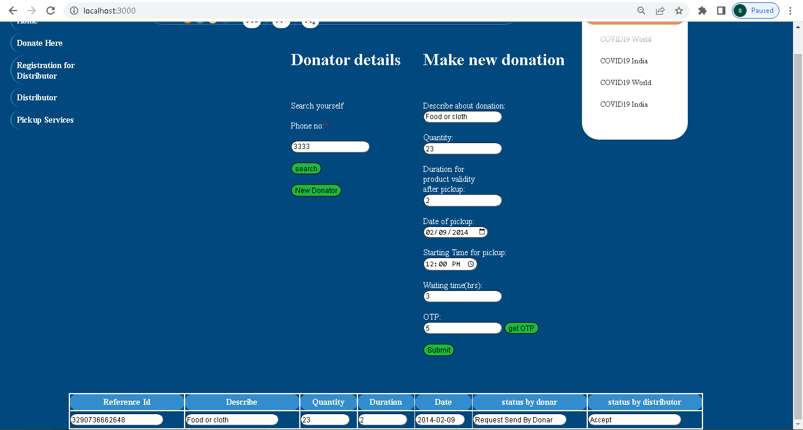
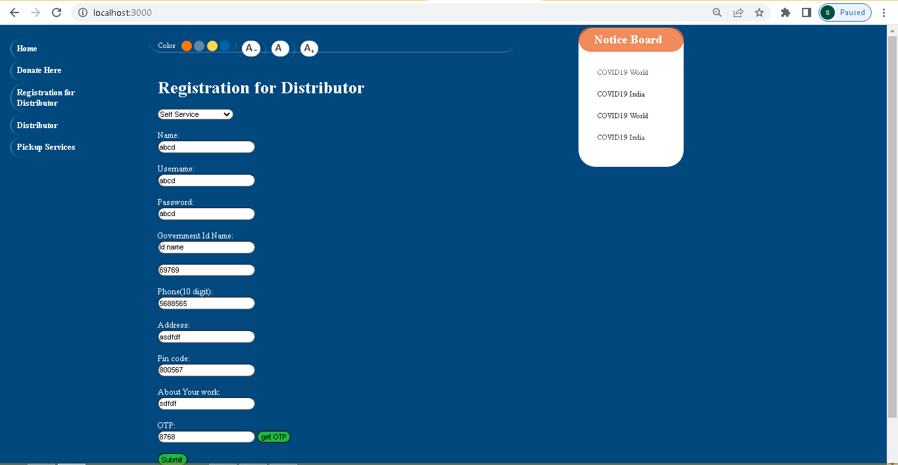
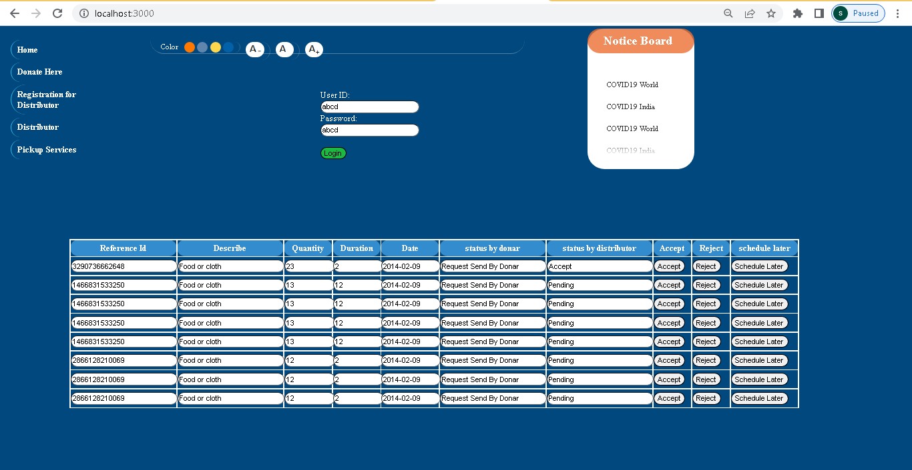
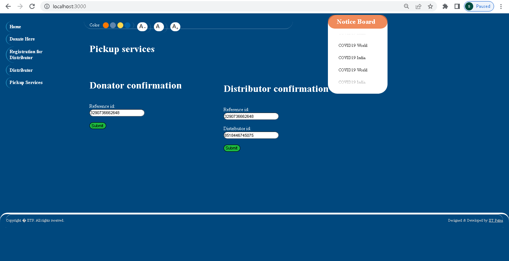

1.Write the project description  
This is a Food Distribution System During Covid Application during covid using BlockChain. Here Distributor and Donar can communicate to facilitate the Food Distrubution System.
Donar put the request for food pickup with details like time of pickup and date of pickup. Donar get verified with sms otp.Distributor register himself with his details,
then he logged in the system to look for the all the pickup request for his pincode.
He then either accept/reject the request. Upon acceptance he communicate with donar for pickup.
 
2.Why this project was chosen  
I have choosen this project because there is lot to learn from this project.This Project uses  private BlockChain using ganache for storage of data.Every update to the system is recorded in blockchain network for accountability. Using Blockchain, our system is transparent and participant are accountable for their action to maintain healthy and hygenic food delivery system.
 

3.How did you make the project. 
This Application is nodejs project uses html,css,javascript and Blockchain for  storage.
Each record is maintained in BlockChain System in the form of transaction which hash unique hash.The details of the transaction can be fetched later.

4.WHAT features, technical things you had implemented.
BlockChain,Nodejs,HTML,CSS,JavaScript
